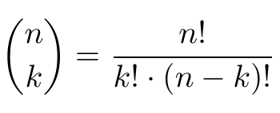

# Binomial coefficient

Simply, it it the result of the following equation:

## Methods inside:
Declaration | Type of result | Time complexity | Memory stack size | Notes
------------|----------------|-----------------|-------------------|------
int BinomialIterative(int n, int k) | result of formula | O(n) | O(1) | 
int BinomialRecursive(int n, int k) | result of formula | O(n) | O(1) |
int BinomialDynamic(int n, int k) | result of formula | O(n^2) | O(n^2) |

BinomialIterative is slightly more efficient then BinomialRecursive.